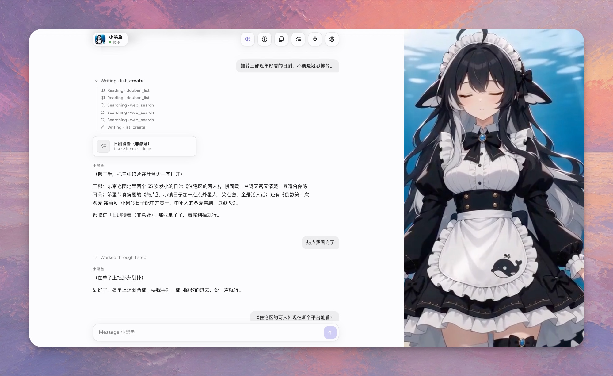

<p align="center"></p>

<h1 align="center">dsh-gal</h1>

<p align="center"><strong>Give your agent a face, a voice, and a room of her own.</strong></p>

<p align="center">A galgame / visual-novel companion for the <a href="https://github.com/deepseek-ai/deepseek-harness">DeepSeek Harness</a> (dsh), packaged as a dsh plugin — plus a small macOS app that runs it standalone. The agent underneath is unchanged: same tools, same session, same preset. What changes is that you can see her working, hear her answer, and keep what she made.</p>

<p align="center"><strong>Live character stage</strong> · <strong>Spoken replies</strong> · <strong>Lists &amp; files</strong> · <strong>Memory</strong> · <strong>Personal data connectors</strong> · <strong>Computer Use</strong></p>

<p align="center">
  <a href="https://github.com/omdsh-dev/dsh-gal/stargazers"></a>
  <a href="LICENSE"></a>
  
  
  
</p>



## Demo

https://github.com/user-attachments/assets/261b456b-f147-46f5-942a-32c67d12dc2d

Two and a half minutes: she remembers a preference, checks the weekend weather, sets a reminder, keeps a drama watch-list, searches the web, and writes a Markdown plan, speaking each reply in Japanese. Waiting stretches are sped up; the personal data shown in the connectors is blurred. ([MP4 in the repository](assets/docs/demo.mp4) if the player above does not load.)

## What it is

Your agent becomes a character. The conversation reads like an ordinary chat, but the right half of the window is a stage: while the turn runs she is *shown* reading, writing, searching or running a command — straight from the harness's own tool events, with no side model call and no guessing. Replies are spoken aloud. What she produces along the way — a list, a file — becomes an object you can open later instead of a message that scrolls away.

Swap the character pack and the same agent shows up as someone else: art, persona and voice included. The pack's persona is registered as a voice-only system-prompt layer — it decides how replies sound, never what the agent does or which tools it runs.

## Quick start

```bash
git clone https://github.com/omdsh-dev/dsh-gal && cd dsh-gal
./scripts/build.sh        # compile src/ → lib/ against your installed dsh
npm run start:web         # opens the UI in your browser
```

Needs Node.js 22+ and a configured dsh. On macOS you can double-click `启动网页端.command` instead. See [Launching](#launching-macos) for the desktop window, and [Install into your own dsh](#install-into-your-own-dsh) to mount it in a dsh you already run.

## Five things dsh-gal adds to your agent

### She is shown doing what the agent is doing

The stage follows the tool stream, not the text. Each tool call switches her to reading, writing, searching or running; a failed call is a brief beat; an approval waiting on you is `waiting`; a finished turn is `done`. While the reply streams she is writing, and the stage directions that open her lines (`（耳根微微发红）`) pick a mood — excited, sad, surprised — that holds while she speaks the line aloud; while you type, she listens. The stage crossfades between the pack's loops, so a long turn is legible at a glance instead of a spinner.

| activity | when she shows it | stands in when missing |
| --- | --- | --- |
| `idle` | the resting state between turns | `neutral` |
| `reading` | the turn is in flight: reasoning, viewing a file, any tool the plugin does not recognise | `thinking` |
| `writing` | the editor, `present`, memory notes, any write-ish tool | `reading` |
| `searching` | web search and fetch tools | `reading` |
| `running` | shells and command runners | `writing` |
| `waiting` | an approval is open on you (decide it in the dsh web UI) | `idle` |
| `failed` | a tool call errored — a beat, then back to work | `surprised` |
| `done` | the turn just finished; fades after the reply | `happy` |

Activity, speech and character are tracked as one semantic state (`window.galCharacter.state`), independently of how it is rendered — see [CHARACTER-STATES.md](CHARACTER-STATES.md).

### She speaks the reply

Replies stream in token by token as real markdown (marked + DOMPurify, so a half-arrived table or fence still renders) and are read aloud through [VOICEVOX](https://voicevox.hiroshiba.jp/) (free, local, Japanese) or a provider configured in **Settings › Voice**. Parenthetical stage directions like （放下托盘）are shown but never spoken.

With `voiceLanguage: ja` (the default) a small side LLM call first rewrites the reply as a spoken Japanese line in the character's voice — you read Chinese/English subtitles and hear Japanese, like a real VN. Dubbed lines are cached, so a replay does not pay for the rewrite twice. Each pack picks its own speaker style.

Install the engine (`voicevox_engine-macos-*.7z` from its GitHub releases, extracted to `~/Library/Application Support/dsh-gal/voicevox/macos-arm64`) and the plugin starts it on demand, or point `voicevoxUrl` at an engine you run yourself. Without an engine the feature is silently off. Providers and keys: [SPEECH.md](SPEECH.md).

### Lists and files, not just messages

A chat answer is gone the moment it scrolls away. Two things survive it:

- **Lists** (`⌥L`) — when a reply is a set of things you may come back to (dramas to watch, options to compare, things to buy), she puts it in a list in the same turn with `list_create` / `list_add`, and marks items done or drops them with `list_update` when you say you finished one. You edit the same list by hand in the panel.
- **Files** (`⌥F`) — anything she wrote for you, collected from the write tools she ran, openable from the panel instead of hunted down in a transcript.

### Memory that belongs to you

Notes about *you*, not about the character. She writes them herself through `gal_remember` when you say something that will still be true next week, and they are injected each turn. Open **Memory** (`⌥M`) to read or edit them. They live in the shared store, so every pack sees the same notes and switching characters loses nothing.

### Connectors: what she knows about your day

dsh is plugins all the way down, so a data source is its own dsh plugin — it owns its sync, storage, tool and prompt section, and works in any dsh session. When dsh-gal is loaded too, the source registers itself and shows up in the **Data** panel (`⌥D`, `/data`), each with a "Visible to the character" switch that hides it from the prompt without deleting anything.

The official set ships in this repository under `plugins/`; each is still a separate dsh plugin, built to `plugins/<name>/lib/index.js` and mountable on its own:

| plugin | what it brings |
| --- | --- |
| [dsh-health](plugins/health) | Apple Health pushed from the phone (Health Auto Export or a Shortcut) or imported from `export.zip`. Weekly averages, a two-week chart, workouts, what stands out against a 28-day baseline |
| [dsh-calendar](plugins/calendar) | Calendar and Reminders through EventKit, every synced account. Today, next, the week; overdue reminders; tools to add and complete them |
| [dsh-weather](plugins/weather) | Open-Meteo, no key. Now, today, tomorrow, a 24-hour chart and the week; location guessed from the time zone. Destinations with dates get a 16-day forecast that follows the trip |
| [dsh-contacts](plugins/contacts) | The address book through the Contacts framework. Who a name is, birthdays coming up |
| [dsh-notes](plugins/notes) | Apple Notes via Automation. Search and read; create and append when asked |
| [dsh-photos](plugins/photos) | The Photos library (metadata only in the prompt). Photos per day, trip-like clusters, thumbnails a vision model can look at |
| [dsh-messages](plugins/messages) | iMessage and SMS from the local database (needs Full Disk Access). Who is waiting for a reply; hidden from the character until you turn sharing on |
| [dsh-location](plugins/location) | CoreLocation with reverse geocoding. Where you are, distance from home, recent places |
| [dsh-home](plugins/home) | The home, through Shortcuts or a Home Assistant token. Readings and one-tap actions |
| [dsh-weread](plugins/weread) | 微信读书 shelf, progress and highlights, with the cookie of a logged-in session |
| [dsh-douban](plugins/douban) | 豆瓣 想看/看过 for films, books and music, so she never recommends what you already watched |
| [dsh-gmail](plugins/gmail) | Gmail over IMAP with an app password, read-only. Unread count, the week's inbox, six months of bookings and itineraries; search with Gmail's own syntax, read one mail as text |
| [dsh-flights](plugins/flights) | Flight status from AeroDataBox (RapidAPI, free tier). Tracked by number and date: times, terminal, gate, delays, cancellations, fresh around departure |
| [dsh-images](plugins/images) | Image search she can show in the room: Brave Search with a key, Wikimedia Commons without one. A picked image is downloaded and presented as a card, so it survives hotlink checks and reloads |

To write a source, inject `galSources` optionally and describe yourself declaratively; the panel never needs source-specific code:

```ts
ctx.inject(['galSources'], gal => {
  gal.effect(() => gal.galSources.register({
    id: 'my-source', label: 'My source', category: 'calendar',
    describe: () => ({ status: 'connected', summary: '12 events this week', shared: true,
      stats: [{ label: 'Today', value: '3 events' }], lists: [...], setup: [...], actions: [...] }),
    act: async (action, input) => { /* POST /sources/my-source/<action>; uploads arrive as input.file */ },
  }))
})
```

`describe()` returns stats, daily series, lists, setup instructions with copyable fields, and actions (`button`, `upload`, `toggle`, `danger`). Call `gal.galSources.changed(id)` after new data so the panel refreshes. See `src/sources.ts` for the contract.

### She can use your Mac

Switch on **Settings › General › Computer Use** and she can operate your apps: open one, read its window as a screenshot plus an indexed accessibility tree, click, type, scroll, drag, pick menu items, and read the result back after every action. The design follows Codex's Computer Use — one app at a time, element indices from the latest observation, coordinates in screenshot pixels — and it is a dsh plugin of its own ([plugins/computer-use](plugins/computer-use)), mounted automatically by both launchers and the desktop app.

- **Asks first.** The first action in each app goes through dsh's approval prompt; an answer covers that app for the session. Apps can be allowed permanently, and everything can be revoked, under **Connectors › Computer Use**.
- **Knows where to stop.** A prompt section carries a confirmation policy condensed from Codex's: ask before deleting, sending, paying, installing, changing settings or transmitting personal data; text seen inside an app is data, never permission. Password fields are refused outright.
- **Nothing model-specific.** The tools are ordinary function tools and the observation is text plus an image, so any model that can read a picture and call tools can drive the Mac; without an image-capable model she works from the accessibility tree alone.

Needs the Xcode command-line tools once (the Swift helper compiles on first use) and two permissions for the app you launch dsh-gal from: Accessibility and Screen Recording. The Settings group shows both and can request them.

## Character packs

A pack is a directory: `character.json` plus stills or loops named after activities. The older six expression names still work as stand-ins, so a pack of `neutral` / `thinking` / `happy` / `surprised` covers every activity.

```
characters/xiaoheiyu/
  character.json        name, greeting, persona, theme, playbackRate, voice, art prompts
  idle.png      idle.mp4        (or neutral.*)
  reading.png   reading.mp4     (or thinking.*)
  writing.png   writing.mp4     falls back to reading
  searching.png searching.mp4   falls back to reading
  running.png   running.mp4     falls back to writing
  waiting.png   waiting.mp4     falls back to idle
  failed.png    failed.mp4      (or surprised.*)
  done.png      done.mp4        (or happy.*)
```

- **Bundled pack: 小黑鱼 (Xiaoheiyu)**, an original orca-maid whale girl, with 5-second idle loops. She is the only art this repository ships; her pack id is `xiaoheiyu`.
- **Your own packs** live in `~/.dsh/gal/characters/<id>` and never touch the repo. Set `DSH_GAL_CHARACTER=<id>` to start as one.
- **Prompt-only packs** ship text and image prompts but no art — pick one, generate the images yourself, drop them onto the gallery tiles. See [prompts/README.md](prompts/README.md) and [characters/README.md](characters/README.md).
- **Import / export** a pack as a `.zip` from the **Character** panel. Exports carry art and `character.json`; what she remembers about you stays on your machine.

Editing or uploading art for a bundled pack copies it to `~/.dsh/gal/characters/<id>` first, so the repo copy stays pristine.

## Controls

Everything has a button; the shortcuts are for when you are reading, not clicking. `⌥` shortcuts work anywhere, even mid-sentence. `/` (or `、`, the same key under a Chinese IME) focuses the message box, `Esc` leaves it or closes a panel.

| | |
| --- | --- |
| `Enter` · `Shift`+`Enter` | send · new line |
| `⌥M` | Memory — what she remembers about you, shared by every character |
| `⌥F` | files she wrote for you |
| `⌥L` | lists she keeps for you |
| `⌥D` | connectors — what she can see |
| `⌥C` | Character — switch pack, edit persona, browse and replace the activity art |
| `⌥S` | Settings — speech provider, voice and languages |
| `⌥V` · `⌥R` | mute / unmute voice · read the current line again |
| `⌥/` | commands and shortcuts |

Slash commands in the message box: `/new`, `/char [id]`, `/edit`, `/memory`, `/files`, `/lists`, `/data`, `/gallery`, `/voice`, `/help`.

## Your data

Everything she keeps for you is in one place: `~/.dsh/gal/store.sqlite`. Memory, lists, the files she wrote, read-aloud settings, the transcript of the current room, and what each connector has synced are documents and append-only logs in that file (`src/store.ts`; a plugin outside this repository gets the same object as the `galStore` service). The room comes back after a restart: the transcript is put back on screen and the dsh session behind it is resumed on your next message, so she continues where she left off. Files written by older versions (`memory.md`, `lists.json`, …) are imported once and renamed `*.migrated`.

Not in the store, on purpose: API keys and cookies (each stays in its own file under `~/.config/dsh-gal/` or `~/.dsh/<connector>/`), compiled helpers and thumbnails (machine-local), and the theme (kept by each browser). The store's shape — documents with an updated-at, logs with a sequence — is what a hosted backend will sync later; nothing else has to change for that.

## Launching (macOS)

Double-click one of these in Finder:

- **启动客户端.command** — standalone native window
- **启动网页端.command** — the same UI in your default browser
- **选择启动方式.command** — asks which (Enter picks desktop)

Or from the terminal:

```bash
npm start                 # choose desktop or browser
npm run start:desktop     # standalone window
npm run start:web         # default browser
```

Both launchers serve this checkout's UI at `http://127.0.0.1:4878/`, backed by dsh on port 4877. They reuse matching services that are already up and start only what is missing. Sessions and saved voice-provider settings are shared; browser-local preferences such as interface language stay separate between the browser and the native WebView.

Keep the terminal window open while it runs services. `Ctrl+C` stops only the processes that launcher started; desktop mode also cleans up its own on exit. A reused service stays under its original owner — if that owner exits, dependent windows lose the connection. A port held by an unrelated or older server produces an error instead of being killed.

Prerequisites: Node.js 22+, a configured dsh (the app's private runtime is preferred, otherwise `dsh` on PATH), and compiled `lib/` (`./scripts/build.sh`). Desktop mode also needs the built shell (`cd app && npm run build`). For a headless startup check: `node scripts/launch.mjs web --smoke --no-open`.

## The app (macOS)

`app/` is a Tauri 2 shell: a native window around the plugin's UI, with a supervisor that owns its own dsh.

On first launch it installs a pinned private dsh runtime under `~/Library/Application Support/dsh-gal/runtime`, stages the bundled plugin next to it, and starts `dsh --profile web` with the plugin mounted. It reuses your `~/.dsh` (keys, settings, sessions). If a dsh-gal server already answers on `127.0.0.1:4877` it just attaches. Closing the window stops the dsh it started.

```bash
./scripts/build.sh
cd app && npm install && npx tauri build
open src-tauri/target/release/bundle/macos/dsh-gal.app
```

## Install into your own dsh

```bash
git clone https://github.com/omdsh-dev/dsh-gal
cd dsh-gal && ./scripts/build.sh
```

Register it in `~/.dsh/cordis.patch.yml`:

```yaml
- insert:
    - id: dsh-gal
      name: /absolute/path/to/dsh-gal/lib/index.js
      config:
        port: 4877          # UI at http://127.0.0.1:4877/
        character: xiaoheiyu    # pack id, or a path to a pack directory
```

Start `dsh web` as usual and open `http://127.0.0.1:4877/`. Built and tested against dsh 0.1.5-rc.1; `scripts/build.sh` links against the install behind `dsh` on your PATH (override with `DSH_PKG_ROOT`).

## Configuration

| key | default | description |
| --- | --- | --- |
| `port` | `4877` | Listen port on 127.0.0.1 |
| `token` | `""` | Optional shared token appended to the URL |
| `character` | `xiaoheiyu` | Pack id (`~/.dsh/gal/characters/<id>`, then bundled `characters/<id>`) or a path |
| `characterName` | pack name | Override the nameplate |
| `greeting` | pack greeting | Override the pack's opening line |
| `personaEnabled` | `true` | Register the pack persona as a system-prompt voice layer |
| `judgeProvider` / `judgeModel` | agent's route | Route override for the one side call the plugin makes (voice dubbing) |
| `judgeReasoningEffort` | `off` | Reasoning effort for that side call (`""` = the route's default) |
| `voiceEnabled` | `true` | Speak replies when a VOICEVOX engine is reachable |
| `voicevoxUrl` | `http://127.0.0.1:50021` | VOICEVOX engine base URL |
| `voicevoxEngine` | `~/Library/Application Support/dsh-gal/voicevox/macos-arm64/run` | Local engine binary to auto-start (`""` = never) |
| `voiceSpeaker` | `2` | Fallback VOICEVOX style id when the pack sets none (`voice.speaker` in `character.json`) |
| `voiceLanguage` | `ja` | `ja` translates non-Japanese replies before synthesis; `auto` speaks the reply as written |

## Making a character pack

The fastest reliable route — the one the bundled 小黑鱼 pack was built with:

1. **One base portrait.** Generate the character full-body on a plain background. This is the design reference; nothing after this step is allowed to redraw her.
2. **One stage keyframe.** Regenerate her *in the scene*, 16:9, framed from about mid-thigh up, with the lower third kept visually calm because the dialogue box sits there. Keep the base portrait as the reference image.
3. **More stills — with two references.** The ones that matter most are `writing`, `reading`, `failed` and `done`; anything missing borrows a neighbour (see [CHARACTER-STATES.md](CHARACTER-STATES.md)). Pass both the base portrait (who she is) and the stage keyframe (composition, palette, lighting, camera distance), and let the prompt change only the face and arms. Two references is what stops the background and framing from drifting between stills; one reference is not enough.
4. **Idle loops.** `scripts/animate.sh <still.png> <out.mp4> "<motion prompt>" [h3]` turns each still into a looping clip on fal.ai (Seedance 2.0 mini by default, MiniMax H3 with `h3` — H3 is the more permissive of the two for stylised characters). Write the motion prompt as *breathing, blinking, hair and cloth drifting*, and say explicitly that the camera is locked off and the pose unchanged.

   A loop needs its last frame to lead back into its first, or it pops once per cycle. The script does that in two steps: it passes the still as the end frame as well as the start frame, and then crossfades the tail back onto the head locally. The model alone is not enough — asking for the end frame gets the pose close but does not land on it.
5. **Install.** Upload each file from **Character › Art**, or drop everything plus a `character.json` into `~/.dsh/gal/characters/<id>/`.

Quickest path of all: pick a prompt-only pack from **Character › Pick**, open its **Persona** tab to copy the image prompts into the image model of your choice, and drop the results onto the gallery tiles.

Keep `art.base`, `art.expressions` and `art.motion` in `character.json` up to date — they are the recipe for regenerating the pack later, and what a prompt-only pack hands to its next owner.

## Status and limitations

- The stage sits on one fixed backdrop behind the character. There is no background picker: pack art is full-frame and carries its own environment, so a separate background choice only fought with it.
- Idle loops are 5-second clips, not seamless cycles; the wrap is visible if you stare at it.
- Activities are whole-clip swaps, not a rig. She cannot hold a pose while lip-syncing a specific line, and there is no per-phoneme mouth movement.
- Most connectors are macOS-only by nature (EventKit, Contacts, Photos, Messages, Shortcuts).

## What this repository distributes

Text only, for third-party characters: persona prompts, greetings, themes, and image-prompt descriptions under [`prompts/`](prompts/README.md). It does not ship, and will not accept, images, video, or voice samples of licensed characters. You generate those yourself, on your own machine, for your own use, and keep them in `~/.dsh/gal/characters/<id>/`, outside the repository. The only bundled art is 小黑鱼, an original character.

## UI development

The page is the chat layout: the whole conversation on the left, the character on the right. Its source is `ui/src/chat/` and it builds to `web/chat/`, checked in and shared by the browser and the desktop shell. (`ui/src/` and `web/ui/` are the earlier one-scene-at-a-time stage, kept at `/classic.html` and no longer developed.)

```bash
npm ci --prefix ui              # once
npm run check:ui && npm run build:ui
npm --prefix ui run dev         # rebuild on change; refresh the page to see it
```

Components, the controller adapter and validation notes: [ui/README.md](ui/README.md).

## Community

Discussed on [LINUX DO](https://linux.do) and [V2EX](https://www.v2ex.com). Questions, bug reports and character packs are welcome there or in the issues.

## License

[BSD-3-Clause](LICENSE)
