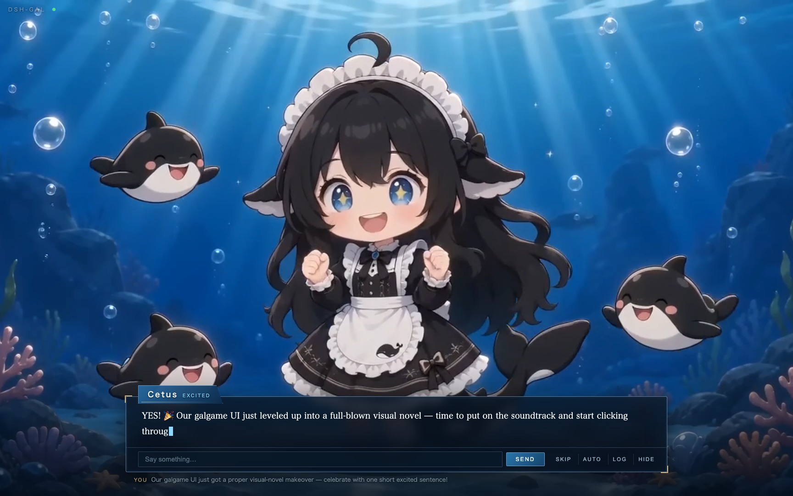

# dsh-gal

A galgame / visual-novel UI for the [DeepSeek Harness](https://github.com/deepseek-ai/deepseek-harness) (dsh), packaged as a dsh plugin — plus a tiny macOS app that runs it standalone.

Your agent becomes a character. Each reply plays as a dialogue scene — typewriter text, one turn at a time, no scrolling wall of history — while she reacts with animated expressions chosen by an emotion judge. The backlog is one click away, just like a real visual novel. Swap the character pack and the same agent shows up as someone else, art and voice included.



## What it does

- **Scene-at-a-time dialogue** — only the latest exchange is on screen, rendered with a typewriter effect. Long replies page like VN text boxes (`click` / `Space` to advance, `Auto` mode available).
- **Character packs** — a directory of six expression sprites + optional idle-motion loops + a `character.json` (name, greeting, persona, theme). The bundled pack is Cetus, a whale girl; private packs live in `~/.dsh/gal/characters/<id>` and never touch the repo. See [characters/README.md](characters/README.md).
- **Voice layer** — the pack's `persona` is registered as a system-prompt section so replies come out in the character's voice. It is explicitly a voice-only layer: tools, work, and technical facts are untouched.
- **Emotion judge** — after each assistant turn, a tiny side LLM call classifies the reply's tone into one of six expressions (`neutral`, `happy`, `thinking`, `surprised`, `sad`, `excited`); a keyword heuristic covers fallback. While the agent works she switches to `thinking` and a status ticker shows tool activity.
- **Runtime switching** — the **CHAR** menu (`C`) lists every discovered pack and switches art, greeting, and voice live.
- **Memory** — each pack keeps a `memory.md`. It is injected into the prompt every turn, the character writes to it herself through the `gal_remember` tool when you tell her something worth keeping, and you can edit it by hand.
- **EDIT** (`E`) — edit the active character's name, greeting, persona, and memory in place. Editing a bundled pack copies it to `~/.dsh/gal/characters/<id>` first.
- **GALLERY** (`G`) — browse the pack's six sprites and idle loops; click one to show it on stage. Drop a `.png` / `.mp4` onto a tile (or use its ↑ button) to upload your own art for that expression — this is how a prompt-only pack becomes a full one without touching the file system.
- **Import / Export packs** — the **CHAR** menu imports a pack `.zip` into `~/.dsh/gal/characters/<id>` and exports the active pack as a `.zip` (art + `character.json`; `memory.md` stays on your machine). Share packs with friends without going through the repo.
- **Slash commands** in the input box: `/new` starts a fresh session, `/char [id]` switches character, `/edit`, `/gallery`, `/log`, `/help`.
- **Backlog** — press `L` or click **LOG** for the full scrollable conversation log.
- **Drive the session from the UI** — the input box sends real user turns into the live dsh session. With no session open, the first message creates one with the deployment's default agent preset (the same tools the browser UI gets).

## The app (macOS)

`app/` is a Tauri 2 shell: a native window around the plugin's UI with a supervisor that owns its own dsh.

On first launch it installs a private dsh runtime under `~/Library/Application Support/dsh-gal/runtime` (pinned version, needs Node.js 22+ on your login shell's PATH), stages the bundled plugin next to it, and starts `dsh --profile web` with the plugin mounted. It reuses your `~/.dsh` (API keys, settings, sessions). If a dsh-gal server is already answering on `127.0.0.1:4877` — say, your own `dsh web` with the plugin registered — the app just attaches to it. Closing the window stops the dsh it started.

```bash
./scripts/build.sh              # compile the plugin
cd app && npm install && npx tauri build
open src-tauri/target/release/bundle/macos/dsh-gal.app
```

Set `DSH_GAL_CHARACTER=haibara` (or any pack id) before launching to pick the starting character; otherwise it starts as Cetus and you switch from the **CHAR** menu.

## Install the plugin into your own dsh

```bash
git clone https://github.com/omdsh-dev/dsh-gal
cd dsh-gal && ./scripts/build.sh   # links against the dsh you have installed and compiles src/ → lib/
```

Register it in `~/.dsh/cordis.patch.yml`:

```yaml
- insert:
    - id: dsh-gal
      name: /absolute/path/to/dsh-gal/lib/index.js
      config:
        port: 4877          # UI at http://127.0.0.1:4877/
        character: cetus    # pack id or path to a pack directory
```

Start `dsh web` as usual and open `http://127.0.0.1:4877/`. Built and tested against dsh 0.1.5-rc.1; `scripts/build.sh` picks up the install behind `dsh` on your PATH (override with `DSH_PKG_ROOT`).

## Configuration

| key | default | description |
| --- | --- | --- |
| `port` | `4877` | Listen port on 127.0.0.1 |
| `token` | `""` | Optional shared token appended to the URL |
| `character` | `cetus` | Pack id (`~/.dsh/gal/characters/<id>`, then bundled `characters/<id>`) or a path |
| `characterName` | pack name | Override the nameplate |
| `greeting` | pack greeting | Override the opening line |
| `personaEnabled` | `true` | Register the pack persona as a system-prompt voice layer |
| `judgeEnabled` | `true` | Use an LLM call to pick the expression (heuristic fallback otherwise) |
| `judgeTimeoutMs` | `8000` | Deadline for the emotion judge before falling back |
| `judgeProvider` / `judgeModel` | agent's route | Route override for the judge call |

## Making a character pack

1. Generate one neutral base portrait (waist-up, 16:9, background included) with any image model.
2. Edit it per expression with the base as the reference — `happy`, `thinking`, `surprised`, `sad`, `excited` — so the character stays consistent.
3. Optional: `scripts/animate.sh <sprite.png> <out.mp4> "<motion prompt>" [h3]` turns each sprite into a 5-second idle loop on fal.ai (Seedance 2.0 mini by default, MiniMax H3 with `h3`; H3 is the more permissive of the two for stylised characters).
4. Either upload each file from **GALLERY**, or drop everything plus a `character.json` into `~/.dsh/gal/characters/<id>/`. An optional `memory.md` seeds what she already knows about you.

The quickest path for a new character: pick a prompt-only pack from **CHAR**, open **EDIT** to copy its image prompts into your image model of choice, then drop the six results onto the **GALLERY** tiles.

## What this repository does and does not distribute

The repository ships **text only** for third-party characters: persona prompts, greetings, themes, and image-prompt descriptions under [`prompts/`](prompts/README.md). It does not ship, and will not accept, images, videos, or voice samples of licensed characters. You generate those yourself, on your own machine, for your own use, and keep them in `~/.dsh/gal/characters/<id>/`, which is outside the repository. The only bundled art is Cetus, an original character.

## License

BSD-3-Clause
